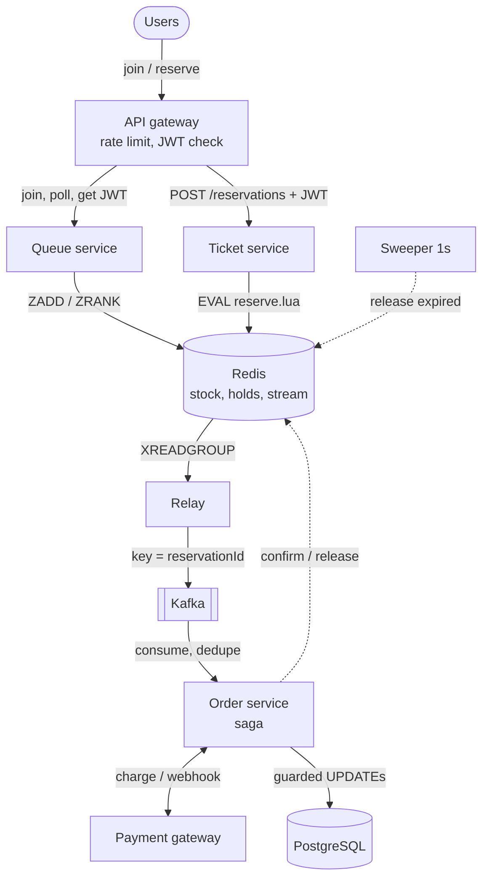

# Whiteboard Flow

Target: explain this out loud in 5 minutes, without notes.

## The 5 steps

1. **Queue.** User joins through the gateway. Queue service stores their position in a Redis ZSET and admits ~5,000/s, each with a 2-minute admission JWT.
2. **Reserve.** User calls `POST /reservations` with the JWT. Ticket service runs one Lua script that checks stock and the per-user limit, decrements `avail`, adds the hold to the holds ZSET and `XADD`s a `reservation.created` event. All atomic. Returns `201 HELD` with a 10-minute expiry.
3. **Relay.** Relay reads the Redis stream and produces to Kafka keyed by `reservationId`. It acks the stream entry only after Kafka confirms.
4. **Order.** Order service consumes the event and inserts `Order(HELD)` with `id = reservationId`. It records `eventId` in `ProcessedEvent`, so duplicates are ignored.
5. **Pay and confirm.** Saga moves `HELD → PAYMENT_PENDING → PAID → CONFIRMED`. Every step is `UPDATE … WHERE state = <expected>`. On confirm, Redis `sold` goes up.

## Failure paths

| Failure | What happens | Invariant kept |
| --- | --- | --- |
| Hold expires | Sweeper finds `score < now` in holds ZSET, runs `release.lua`, stock returns | I1 |
| Payment declined | `PAYMENT_FAILED → RELEASED`, stock returns, nothing charged | I1, I3 |
| Paid after hold expired | Refund issued, order `REFUNDED` | I3 |
| Relay crashes | Un-acked stream entries are re-sent on restart; consumers dedupe by `eventId` | I6 |
| Duplicate webhook | Second `UPDATE … WHERE state = 'PAYMENT_PENDING'` matches 0 rows | I6 |

## Pass criteria

- [ ] All 5 steps in about 5 minutes, no notes
- [ ] At least 3 failure paths explained
- [ ] Say which invariant each step could break
- [ ] Mention idempotency and guarded transitions without being asked